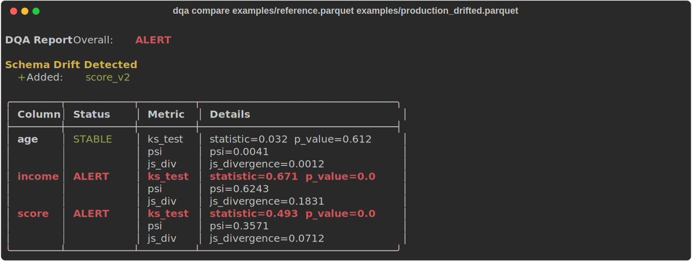
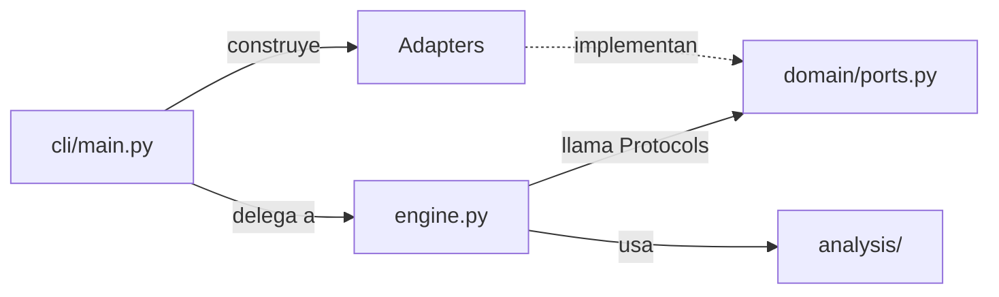

# dqa — Detector de Drift Estadístico para Datasets ML


Detecta drift de distribución entre datasets de entrenamiento y producción.
Un comando. Análisis estadístico en capas. Exit codes para CI/CD.

```sh
dqa compare train.parquet prod.parquet
```

---

## Por qué dqa

Si tu detector de drift no se puede llamar desde un Makefile, es un dashboard, no una herramienta de monitoreo.

| Característica | dqa | Great Expectations | Evidently AI | whylogs | NannyML |
|----------------|-----|--------------------|--------------|---------|---------|
| CLI con exit codes | ✅ | ❌ | ❌ | ❌ | ❌ |
| Sin servidor ni daemon | ✅ | ✅ | ✅ | ✅ | ✅ |
| Instalación < 10 s | ✅ | ❌ | ✅ | ✅ | ✅ |
| Formatos mixtos (CSV + Parquet) | ✅ | ✅ | ✅ | ✅ | ❌ |
| Análisis en capas (clásico + info-teoría + bayesiano) | ✅ | ❌ | Parcial | Parcial | Parcial |
| Integrable en CI/CD sin configuración | ✅ | ❌ | ❌ | ❌ | ❌ |

---

## Instalación

```sh
git clone https://github.com/Gerardo1909/causal-data-quality-auditor
cd causal-data-quality-auditor
uv sync
```

```sh
# Opcional: análisis bayesiano (PyMC + nutpie + ArviZ — instalación ~60 s)
uv sync --extra bayesian
```

---

## Inicio rápido

```sh
# Generar datasets de ejemplo
uv run python examples/generate_fixtures.py

# Sin drift — exit 0
dqa compare examples/reference.parquet examples/production_stable.parquet

# Con drift — exit 1
dqa compare examples/reference.parquet examples/production_drifted.parquet

# Formatos mixtos: CSV de referencia, Parquet de producción
dqa compare examples/reference.csv examples/production_drifted.parquet
```



---

## Cómo funciona

`dqa` aplica cuatro capas de análisis sobre cada columna numérica. Cada capa es independiente y suma evidencia.

### Capa 0 — Schema drift (sin dependencias externas, siempre corre)

Detecta cambios estructurales antes de cualquier cálculo estadístico:
columnas añadidas, columnas removidas, tipo de dato cambiado.

### Capa 1 — Estadística clásica (`scipy`)

| Test | Umbral STABLE | Umbral WARNING | Umbral ALERT |
|------|--------------|----------------|--------------|
| KS test | p ≥ 0.05 | — | p < 0.05 |
| PSI | PSI < 0.1 | 0.1 ≤ PSI ≤ 0.2 | PSI > 0.2 |

El PSI (Population Stability Index) es el estándar de la industria financiera (Basel II) para medir drift de distribución.
El KS test provee un p-value complementario para validar la misma hipótesis.

### Capa 2 — Teoría de la información (`scipy` + KDE gaussiano)

| Métrica | Umbral STABLE | Umbral WARNING | Umbral ALERT |
|---------|--------------|----------------|--------------|
| KL Divergence | — | — | asimétrica, referencial |
| Jensen-Shannon | JS < 0.05 | 0.05 ≤ JS ≤ 0.10 | JS > 0.10 |

La divergencia Jensen-Shannon es simétrica y acotada en [0, 1], lo que la hace más interpretable que KL.
Las distribuciones se estiman con kernel density estimation (KDE gaussiano) para manejar variables continuas.

### Capa 3 — Bayesiana (opcional, `--bayesian`)

| Overlap HDI 94% | Nivel |
|-----------------|-------|
| overlap > 0.6 | STABLE |
| 0.3 ≤ overlap ≤ 0.6 | WARNING |
| overlap < 0.3 **o** μ_prod fuera del HDI de μ_ref | ALERT |

En lugar de un p-value, ajusta `Normal(μ, σ)` a cada dataset con MCMC (PyMC + nutpie)
y compara los intervalos de alta densidad posterior (HDI 94%) de μ.
Permite responder: *"¿el μ de producción está dentro del rango plausible del μ de referencia?"*

### Niveles de drift

| Nivel | Símbolo | Significado |
|-------|---------|-------------|
| STABLE | 🟢 | Sin cambio significativo |
| WARNING | 🟡 | Cambio moderado — monitorear |
| ALERT | 🔴 | Cambio significativo — investigar |

El nivel de cada columna es el peor de todos sus análisis. El nivel del dataset es el peor de todas sus columnas.

---

## Referencia CLI

```
dqa compare REFERENCE PRODUCTION [OPCIONES]
```

| Argumento / Opción | Por defecto | Descripción |
|--------------------|-------------|-------------|
| `REFERENCE` | requerido | Dataset de referencia (entrenamiento). Formatos: `.parquet`, `.csv`, `.ndjson` |
| `PRODUCTION` | requerido | Dataset de producción. Puede ser un formato distinto al de referencia |
| `-c`, `--columns` | todas | Columnas numéricas a analizar, separadas por coma (ej: `age,price`) |
| `-f`, `--format` | `terminal` | Formato del reporte: `terminal` (tabla Rich) o `markdown` |
| `-o`, `--output` | stdout | Archivo donde guardar el reporte Markdown |
| `--fail-on` | `alert` | Nivel mínimo de drift que causa exit code 1: `alert`, `warning`, `never` |
| `--bayesian` | desactivado | Activa análisis bayesiano con PyMC (requiere `uv sync --extra bayesian`) |

### Exit codes

| Código | Significado |
|--------|-------------|
| `0` | Sin drift al nivel configurado (o `--fail-on never`) |
| `1` | Drift detectado al nivel configurado con `--fail-on` |
| `2` | Error de entrada: formato no soportado u otro problema |

---

## Formatos de salida

### Terminal (por defecto)

Tabla coloreada con semáforos 🟢🟡🔴, schema diff y resumen overall.
Ver imagen arriba o ejecutar:

```sh
dqa compare examples/reference.parquet examples/production_drifted.parquet
```

### Markdown

Reporte estructurado, ideal para adjuntar a PRs o pipelines de CI.
Ver ejemplo completo en [`docs/assets/markdown_report_sample.md`](docs/assets/markdown_report_sample.md).

```sh
# Guardar reporte Markdown
dqa compare ref.parquet prod.parquet --format markdown --output reporte.md

# Imprimir Markdown en stdout (útil para pipes)
dqa compare ref.parquet prod.parquet --format markdown
```

---

## Integración CI/CD

### Básico — falla en drift severo

```yaml
- name: Detectar drift
  run: uv run dqa compare data/train.parquet data/prod.parquet
```

### Con reporte como artefacto

```yaml
- name: Detectar drift y guardar reporte
  run: |
    uv run dqa compare data/train.parquet data/prod.parquet \
      --format markdown --output drift-report.md --fail-on warning

- name: Subir reporte
  if: always()
  uses: actions/upload-artifact@v4
  with:
    name: drift-report
    path: drift-report.md
```

### Informativo (sin bloquear el pipeline)

```yaml
- name: Auditoría de drift (no bloqueante)
  run: uv run dqa compare data/train.parquet data/prod.parquet --fail-on never
```

---

## Análisis Bayesiano

El análisis bayesiano responde una pregunta más rica que un p-value:

> *"¿La media de producción está dentro del rango de valores plausibles para la media de referencia?"*

Un p-value del KS test solo dice si dos distribuciones son distinguibles con el tamaño de muestra actual.
El HDI 94% de μ dice exactamente dónde está la media y con qué certeza.

**Cómo funciona internamente:**
1. Ajusta `Normal(μ, σ)` a cada dataset con 2 cadenas MCMC (500 draws + 500 warmup) via PyMC + nutpie.
2. Extrae el posterior de μ y calcula el HDI 94%.
3. Mide el overlap normalizado entre ambos HDIs.
4. Verifica si μ_prod_mean cae dentro del HDI de referencia.

**Nota de rendimiento:** ~30–60 segundos por columna. Usar `--columns` para limitar el scope cuando el dataset tiene muchas columnas numéricas.

```sh
# Analizar solo las columnas más críticas
dqa compare train.parquet prod.parquet --bayesian --columns income,score
```

Las trazas MCMC se guardan automáticamente en `/tmp/dqa_bayesian_ref.nc` y `/tmp/dqa_bayesian_prod.nc`
para auditoría posterior con ArviZ.

---

## Arquitectura

```
causal-data-quality-auditor/
├── dqa/
│   ├── domain/
│   │   ├── models.py          # Dataclasses puras: ColumnReport, DatasetReport, DriftLevel
│   │   └── ports.py           # Protocols: DataReader, ColumnAnalyzer, Reporter
│   ├── analysis/
│   │   ├── schema.py          # Capa 0: schema drift (sin deps externas)
│   │   ├── classical.py       # Capa 1: KS test, PSI (scipy)
│   │   └── information.py     # Capa 2: KL/JS Divergence (scipy + KDE)
│   ├── adapters/
│   │   ├── readers/
│   │   │   └── polars_reader.py   # Parquet, CSV, NDJSON vía Polars
│   │   ├── reporters/
│   │   │   ├── rich_reporter.py
│   │   │   └── markdown_reporter.py
│   │   └── bayesian/
│   │       └── pymc_analyzer.py   # Solo se importa si --bayesian
│   ├── engine.py              # Orquesta análisis por columna — acepta adapters via DI
│   └── cli/
│       └── main.py            # Typer CLI: cablea adapters, llama engine
├── examples/
│   ├── generate_fixtures.py   # Script reproducible para generar datasets de prueba
│   ├── reference.parquet / reference.csv
│   ├── production_stable.parquet
│   └── production_drifted.parquet
└── tests/
```

**Principio central:** `engine.py` no importa ningún adapter concreto. Solo habla con los Protocols de `domain/ports.py`.
Agregar un nuevo formato de lectura, un nuevo reporte, o un nuevo algoritmo de análisis
no requiere tocar el engine ni el dominio.



---

## Roadmap

**v0.2:**
- **Columnas categóricas:** TVD + chi-square — el adapter es el mismo, solo nuevos analyzers.
- **Thresholds por columna:** comando `dqa config init` genera `dqa.yaml` con valores por defecto.
- **Reporte HTML:** agregar `--extra html` con Jinja2. El esqueleto de `MarkdownReporter` ya anticipa el pattern.
- **`dqa profile`:** análisis de un solo dataset sin comparación — nuevo subcomando, sin tocar el engine.

---

## Licencia

MIT © [Gerardo Toboso](mailto:gerardotoboso1909@gmail.com)
